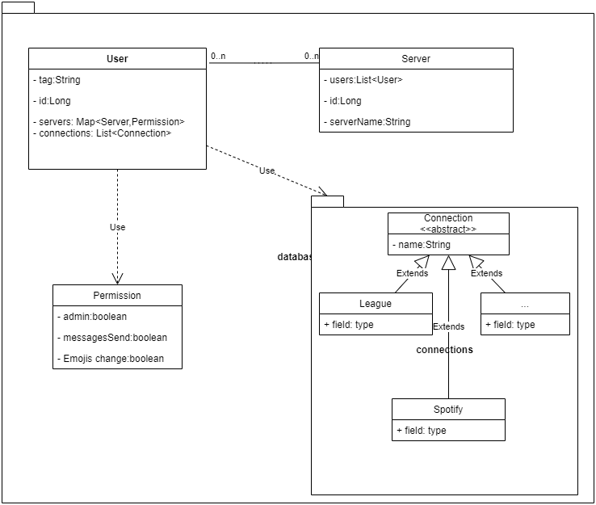

1. Plugin system
2. Multiple Servers
3. Configsystem for the plugins
4. Each plugin server wise configurable
5. Tracking, who invated the bot
6. Voice module active
7. User Definition
8. Server Definition
9. Text Channel Definition
10. Minimum use of JDA
11. Threads managed from the Bot
12. Oauth system
13. Store user in database
14. File storage of plugin data

#Plugins
Plugins register commands and when somebody enters this command in a for the bot visible channel, the command will be executed.
The Plugin will get a User Object and a Textchannel object. 

#User
A user has 0 or more server, an ID, privileges per Server. It will be saved in a database. If no database is available, fallback to file storage.

